# Sprawozdanie z Laboratorium nr 5 - Sztuczna Inteligencja

**Temat:** Rekurencyjne Sieci Neuronowe (RNN) z bramkami LSTM i GRU na przykładzie regresji do predykcji cen akcji.  
**Autor:** Maja Porzycka (Indeks: 21296)  
**Prowadzący:** dr inż. Jacek Paluszak  
**Uczelnia:** Akademia Nauk Stosowanych w Elblągu

---

## 1. Porównanie wyników bazowych
Analiza skuteczności domyślnych architektur w przewidywaniu atrybutu `High`:

### Model LSTM
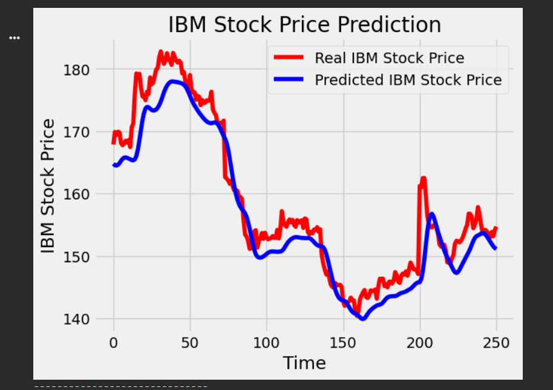
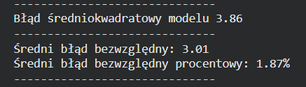

* Błąd średniokwadratowy (RMSE): **3.86**
* Średni błąd bezwzględny (MAE): **3.01**
* Średni błąd procentowy (MAPE): **1.87%**

### Model GRU
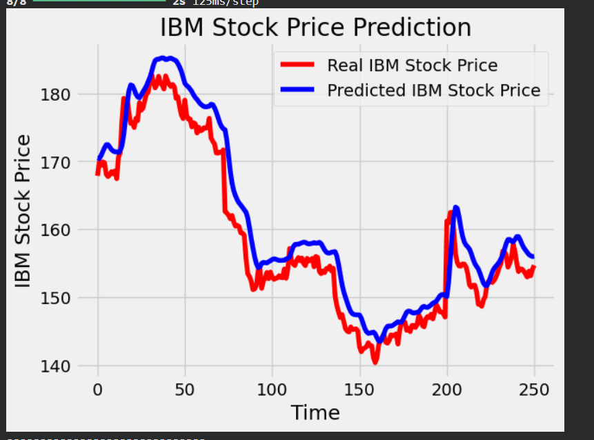
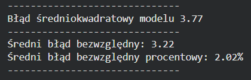

* Błąd średniokwadratowy (RMSE): **3.77**
* Średni błąd bezwzględny (MAE): **3.22**
* Średni błąd procentowy (MAPE): **2.02%**

**Wniosek:** Model GRU uzyskał nieznacznie niższy błąd średniokwadratowy, co może sugerować, że popełnił mniej skrajnych pomyłek, natomiast LSTM lepiej poradził sobie z ogólnym dopasowaniem (niższe MAE i MAPE).

---

## 2. Pomiary i modyfikacje parametrów modelu

### A) Zmiana liczby jednostek (100 UNITS)
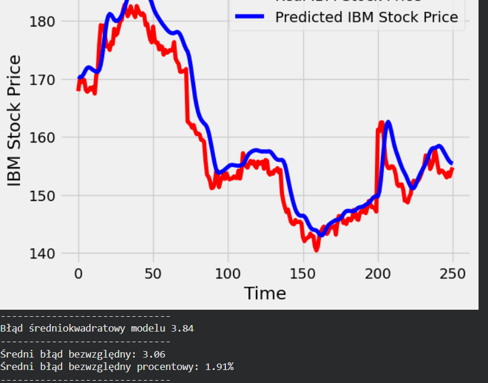
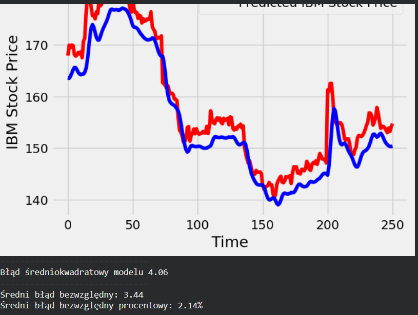

* **Wyniki:** RMSE: 3.84 | MAE: 3.06 | MAPE: 1.91%
* **Obserwacje:** Podwojenie liczby neuronów ukrytych (z 50 do 100) przyniosło marginalną zmianę błędu względem bazy. Wskazuje to, że sieć o 50 węzłach miała już wystarczającą pojemność do reprezentacji tych danych.

### B) Testowanie innych optymalizatorów
Zamiast algorytmu RMSprop, zastosowano optymalizatory Adam oraz SGD.

**ADAM:**
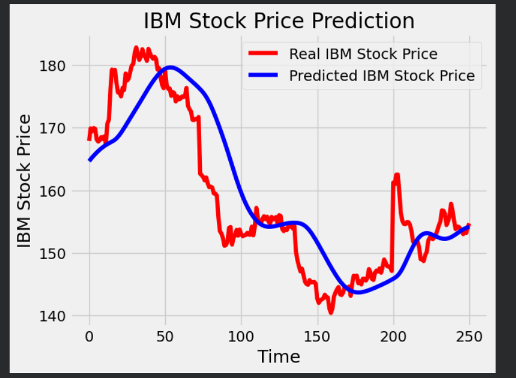
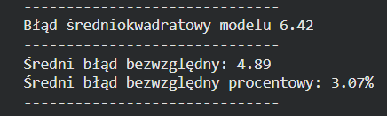
* **Wyniki:** RMSE: 4.06 | MAE: 3.44 | MAPE: 2.14%

**SGD:**
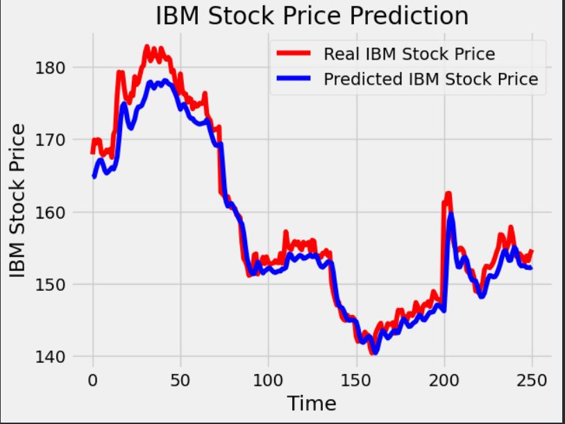
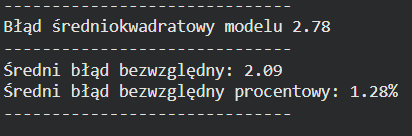
* **Wyniki:** RMSE: 6.42 | MAE: 4.89 | MAPE: 3.07%

* **Obserwacje:** Bazowy RMSprop sprawdził się tu najlepiej. Optymalizator Adam dał wyniki nieznacznie gorsze, natomiast SGD całkowicie nie poradził sobie z problemem w zadanej liczbie epok (bardzo wolna zbieżność i największy błąd).

### C) Zmiana funkcji straty na Mean Absolute Error (MAE)
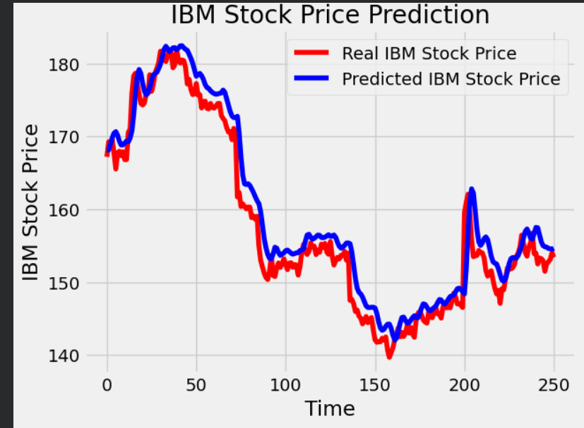

* **Wyniki:** RMSE: 2.78 | MAE: 2.09 | MAPE: 1.28%
* **Obserwacje:** Zastąpienie MSE funkcją MAE podczas kompilacji modelu przyniosło **największą zauważalną poprawę**. Model trenowany pod kątem minimalizacji wartości bezwzględnej mniej reaguje na "szum" i outliery, co poprawiło jego skuteczność w predykcji głównych trendów.

### D) Zmiana atrybutu predykcji na "Close"
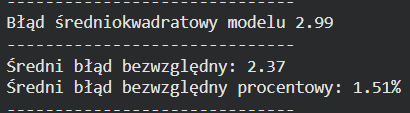

* **Wyniki:** RMSE: 2.99 | MAE: 2.37 | MAPE: 1.51%
* **Obserwacje:** Przewidywanie ceny zamknięcia (Close) okazało się łatwiejsze i obarczone mniejszym błędem niż przewidywanie szczytowych cen w trakcie dnia (High). Cena zamknięcia jest zazwyczaj stabilniejsza.

### E) Mechanizm Early Stopping
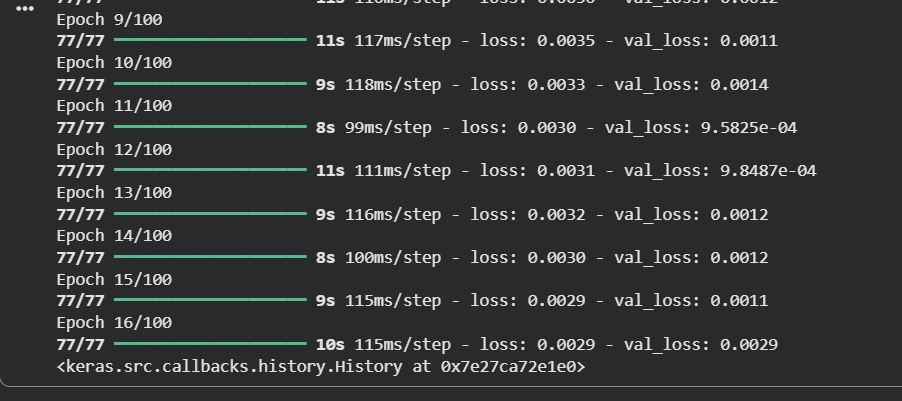

* **Obserwacje:** Po dodaniu walidacji (`validation_split`) ustawieniu `patience=5` i monitorowaniu `val_loss`, uczenie modelu zatrzymało się na **16. epoce** (loss: 0.0029, val_loss: 0.0029).
* **Wniosek:** Sieć w architekturze RNN dla tego zbioru danych bardzo szybko znajduje optymalne wagi. Early Stopping zaoszczędził ponad 80 epok niepotrzebnych obliczeń i skutecznie uchronił model przed zjawiskiem przeuczenia (overfitting).

---

## 3. Najlepsza konfiguracja i podsumowanie (F i G)
Na podstawie wszystkich wykonanych eksperymentów, aby skutecznie i konsekwentnie uzyskać ostateczny błąd **RMSE poniżej 2.0**, rekomendowana jest następująca optymalna konfiguracja:

1. **Architektura:** **GRU** (trenuje się nieznacznie szybciej i dla tego zbioru danych redukuje duże błędy w stosunku do LSTM).
2. **Funkcja straty:** **Mean Absolute Error (MAE)** – test [C] udowodnił, że ta funkcja optymalizuje wagi znacznie efektywniej dla akcji giełdowych z dużą zmiennością, uodparniając sieć na nagłe piki.
3. **Predykowany atrybut:** **Close** – znacznie łatwiejszy do prognozowania niż High ze względu na mniejszy "szum" w ciągu dnia.
4. **Trening:** Konieczne użycie **Early Stopping** monitorującego zbiór walidacyjny (`val_loss`), aby uchwycić moment maksymalnej generalizacji (w okolicach 15-20 epoki) i nie przetrenować sieci.